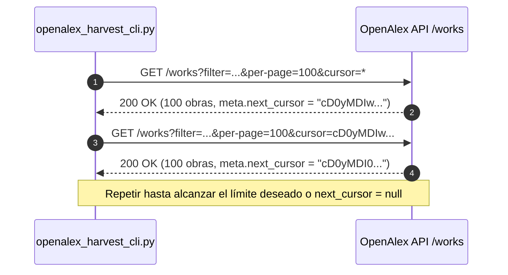

# Guía de Paginación por Cursor en OpenAlex

La paginación por cursor es el mecanismo canónico y más rápido para recorrer millones de registros sin sufrir penalizaciones de memoria o desplazamiento (`offset`).

---

## 1. Funcionamiento del Algoritmo de Cursor

---

## 2. Ventajas frente a Paginación por Página Numérica (`page=N`)

1. **Rendimiento O(1) en cada salto:** La base de datos no recorre los $N \times 100$ registros previos.
2. **Consistencia de datos:** Los registros insertados o actualizados en tiempo real no desplazan ni duplican elementos entre páginas.
3. **Escalabilidad:** Permite extraer 10,000+ artículos en minutos de forma completamente estable.
